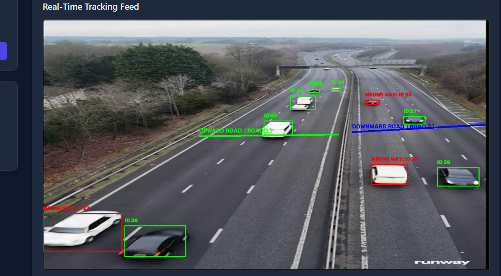

<div align="center">

# 🚗 AI Vehicle Tracking & Wrong-Way Detection System



# Poster OF AI Vehicle Tracking & Wrong-Way Detection System


<br/>


</div>

A real-time AI-powered traffic monitoring solution designed to detect vehicles, track them across frames, assign unified re-identification (Re-ID) IDs, and flag wrong-way driving violations on multi-lane highways.

The system features a **FastAPI** backend for video processing and vector database operations, alongside a **Next.js / React** frontend for real-time video streaming, lane calibration, and violation monitoring.

---

## ✨ Key Features

* 🎯 **High-Resolution Object Detection**: Powered by **YOLO11** running at native frame resolution (`imgsz=1280`) to reliably catch small, distant vehicles near the horizon.

* 🔗 **Multi-Object Tracking**: Uses **ByteTrack** with customized track initialization and persistence thresholds to maintain stable trajectories for fast-moving targets.

* 🧬 **Vehicle Re-Identification (Re-ID)**: Integrates an **OSNet** feature extractor paired with **Qdrant Vector Database** to maintain consistent vehicle identity across track losses.

* 🚨 **Wrong-Way Driving Detection**: Automated trajectory analysis based on lane calibration points to detect vehicles traveling against the flow of traffic.

* 🛣️ **Interactive Lane Calibration**: Web GUI allowing operators to draw and calibrate upward and downward travel lanes directly on live camera feeds.

* 📸 **Violation Capture**: Auto-captures and logs cropped violation snapshots with timestamps and unique IDs upon persistent wrong-way detection.

---

## 🏗️ Architecture Overview

```text
[ Video Stream / File Input ]

              │

              ▼

    [ YOLO11 + ByteTrack ] ──(Detections & Bounding Boxes)

              │

              ▼

   [ OSNet Feature Extractor ] ──(512-dim Embeddings)

              │

              ▼

   [ Qdrant Vector DB ] ──(Cosine Similarity Match / Assign Re-ID)

              │

              ▼

 [ Trajectory & Line Calibration Engine ] ──(Wrong-Way Check)

              │

              ▼

[ FastAPI Stream / Next.js Dashboard ] ──(Real-time Canvas Overlay)
```

## 🧰 Tech Stack

### 🐍 Backend

* Python 3.10+
* FastAPI (ASGI Web Framework)
* Ultralytics YOLO11 (Vehicle Detection)
* ByteTrack (Multi-Object Tracking)
* PyTorch & ONNX Runtime (OSNet Re-ID Feature Extraction)
* Qdrant Client (Vector Similarity Search)
* OpenCV & NumPy (Image Processing & Trajectory Math)

### ⚛️ Frontend

* Next.js / React
* TypeScript
* Tailwind CSS
* HTML5 Canvas (Interactive Line Calibration)

## ⚙️ Installation & Setup

### 1. Repository Setup

```bash
git clone https://github.com/nameluqman/AI-Vehicle-Tracking-and-Wrong-Way-Detection-System.git
cd AI-Vehicle-Tracking-and-Wrong-Way-Detection-System
```

### 2. Backend Setup

Create and activate a Python virtual environment:

```bash
python -m venv venv

# On Windows PowerShell:
.\venv\Scripts\Activate.ps1

# On Linux/macOS:
source venv/bin/activate
```

Install backend dependencies:

```bash
pip install -r backend/requirements.txt
```

Start the FastAPI server:

```bash
cd backend
uvicorn main:app --reload --host 0.0.0.0 --port 8000
```

### 3. Frontend Setup

Open a new terminal and navigate to the frontend directory:

```bash
cd frontend
```

Install Node modules:

```bash
npm install
```

Run the development server:

```bash
npm run dev
```

Open [http://localhost:3000](http://localhost:3000) in your browser.


## 📁 Project Structure

```plaintext
├── backend/
│   ├── yolo11m.pt               #model used for detection
│   ├── qdrant_db/               # Local Qdrant vector database storage
│   ├── custom_bytetrack.yaml    # Customized ByteTrack config
│   ├── pipeline.py              # YOLO, Tracking, Re-ID & Wrong-Way logic
│   ├── main.py                  # FastAPI routes and streaming endpoints
│   └── requirements.txt         # Python package dependencies
├── frontend/
│   ├── app/                     # Next.js pages and globals
│   └── components/              # Interactive UI & Lane Calibration Canvas
├── assets/                      # README images and documentation assets
├── .gitignore                   # Excluded weights, DBs, and media files
└── README.md
```

## 📄 License

Distributed under the MIT License. See LICENSE for more information.